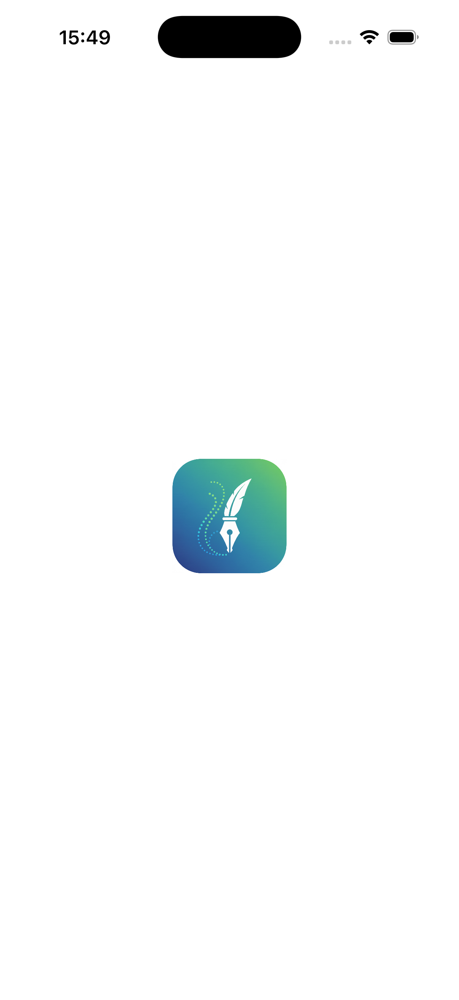
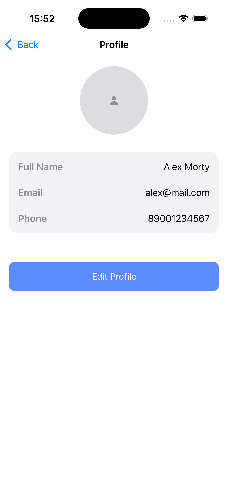
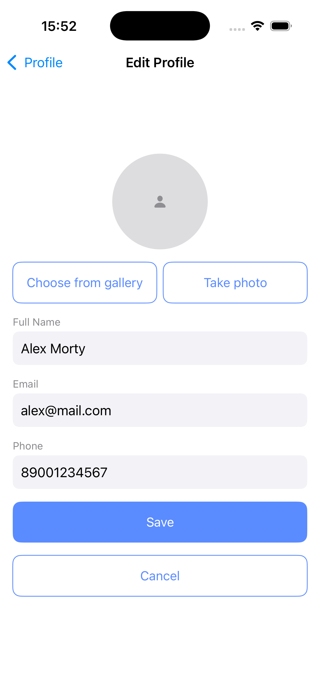

# 👤 SwiftUI Profile Management App

This is a simple profile management demo app built with SwiftUI.
The app demonstrates local profile persistence, media handling, and form validation using SwiftData.

The project focuses on clean navigation, strict MVVM architecture, and proper separation of UI and business logic.

## ✨ Features

- Splash screen with automatic navigation
- Minimal Home screen
- Profile viewing screen
- Edit Profile flow
- Local profile persistence using SwiftData
- Profile image selection from camera and gallery
- Image cropping using Mantis SDK
- Inline form validation
- Loading and error state handling
- Dependency Injection
- Strict MVVM architecture

## 🖼 Screenshots

  
  
  
  

## 🔄 App Flow

### App Launch

- On app launch, the Splash Screen is shown
- After the splash screen, the app navigates to the Home Screen
- Profile data is fetched from SwiftData when the app starts

## 🏠 Home Screen

- Displays the app title
- Contains a Go to Profile button
- Navigation is handled using NavigationStack
- No business logic is handled on this screen

## 👤 Profile Screen

Displays stored user profile information:

- Profile image (circular)
- Full name
- Email address (read-only)
- Phone number

- Shows a placeholder image if no profile image exists
- Data is loaded immediately when the screen appears
- Contains an Edit Profile button

## ✏️ Edit Profile Screen

Allows the user to update profile information

### Editable fields
- Full name
- Phone number
- Profile image

### Non-editable field
- Email address (visible but disabled)

### Profile Image Options
- Pick image from gallery
- Capture image using camera
- Crop image using Mantis SDK

## ✅ Validation

- Full name cannot be empty
- Phone number must be numeric
- Inline validation messages are shown
- Save button is disabled if validation fails
- Loading indicator is displayed while saving

## 🧭 Navigation Behavior

### Save
- Updates the existing profile in SwiftData
- Navigates back to the Profile Screen

### Cancel
- Discards all changes
- Navigates back to the Profile Screen

## 💾 Data Persistence

- Profile data is stored locally using SwiftData
- Existing profile data is fetched when the app starts
- Profile data is updated on save
- UserDefaults are not used

## 🧱 Architecture

- Built entirely with SwiftUI
- Uses NavigationStack for navigation
- Follows MVVM architecture
- Views contain UI only
- ViewModels handle logic, validation, and state
- Models are defined as SwiftData entities
- Dependencies are injected via initializers

## 🛠 Tech Stack

- Swift
- SwiftUI
- SwiftData
- NavigationStack
- MVVM
- Mantis SDK

## 👩‍💻 Author

Nadira Seitkazy  
Junior iOS Developer
